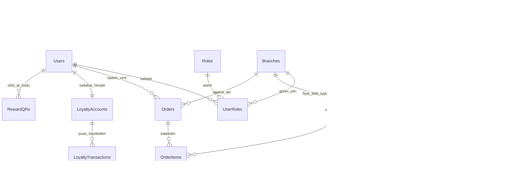
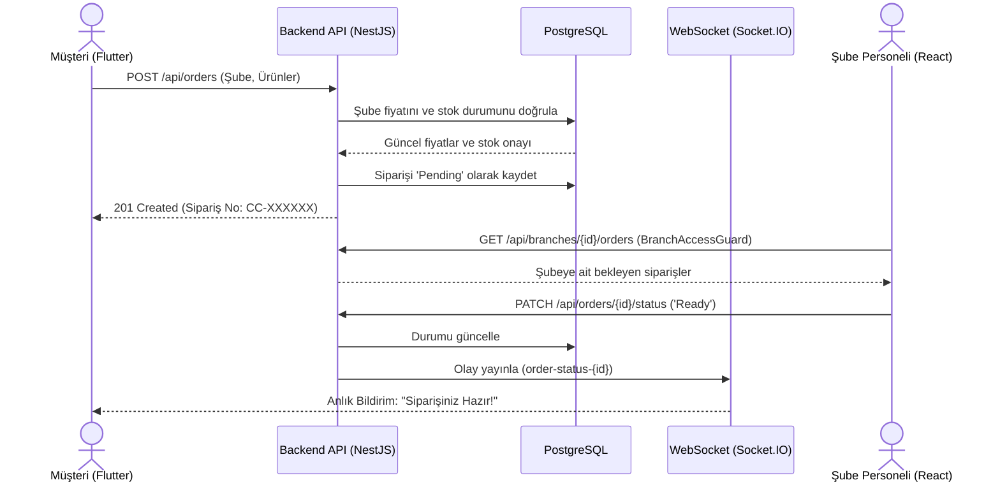

# 📊 CupClub — Veritabanı (ER) ve Sistem Akış (UML) Diyagramları

## 1. Varlık-İlişki Diyagramı (ER Diagram)

```mermaid
erDiagram
    Users ||--o{ UserRoles : "sahiptir"
    Roles ||--o{ UserRoles : "atanir"
    Branches ||--o{ UserRoles : "gorev_yeri"
    Categories ||--o{ Products : "icerir"
    Branches ||--o{ BranchProducts : "fiyat_stok_tutar"
    Products ||--o{ BranchProducts : "subede_satilir"
    Products ||--o{ ProductOptionGroups : "secenek_grubu"
    ProductOptionGroups ||--o{ ProductOptions : "secenekler"
    Users ||--o{ Orders : "siparis_verir"
    Branches ||--o{ Orders : "siparisi_alir"
    Orders ||--o{ OrderItems : "kalemleri"
    Products ||--o{ OrderItems : "urun_detayi"
    Campaigns ||--o{ CampaignRules : "kurallari"
    Campaigns ||--o{ Coupons : "kupon_uretir"
    Users ||--|| LoyaltyAccounts : "sadakat_hesabi"
    LoyaltyAccounts ||--o{ LoyaltyTransactions : "puan_hareketleri"
    Users ||--o{ RewardQRs : "odul_qr_kodu"
```

## 2. Uçtan Uca Sipariş ve Canlı Bildirim Akışı (Sequence Diagram)

```mermaid
sequenceDiagram
    actor Musteri as Müşteri (Flutter)
    participant API as Backend API (NestJS)
    participant DB as PostgreSQL
    participant WS as WebSocket (Socket.IO)
    actor Personel as Şube Personeli (React)

    Musteri->>API: POST /api/orders (Şube, Ürünler)
    API->>DB: Şube fiyatını ve stok durumunu doğrula
    DB-->>API: Güncel fiyatlar ve stok onayı
    API->>DB: Siparişi 'Pending' olarak kaydet
    API-->>Musteri: 201 Created (Sipariş No: CC-XXXXXX)
    Personel->>API: GET /api/branches/{id}/orders (BranchAccessGuard)
    API-->>Personel: Şubeye ait bekleyen siparişler
    Personel->>API: PATCH /api/orders/{id}/status ('Ready')
    API->>DB: Durumu güncelle
    API->>WS: Olay yayınla (order-status-{id})
    WS-->>Musteri: Anlık Bildirim: "Siparişiniz Hazır!"
```
